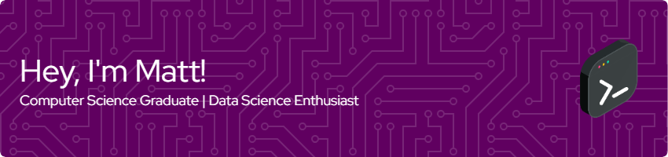

# Matt Hogan

 

As an undergraduate student studying Computer Science at the University of Rhode Island, I feel as though I am one step closer to becoming the magician my younger self once believed was behind technology as we know it. With each course, I am faced with new challenges which, although sometimes stressful, have a payoff like no other. It's truly amazing to be pursuing this passion of mine and I look forward to bringing my ideas and what I learn to the industry.

- [View Resumé](https://hoganmatt.me/about/resume.pdf)
- [View LinkedIn](https://www.linkedin.com/in/matthewdhogan25)
- [Personal Website](https://hoganmatt.me/)

## Contact

**Email**: matthewdhogan25@gmail.com 
**.edu Email**: mdhogan@uri.edu 
**Discord**: paradoxician

## Education

**University of Rhode Island**, Kingston, RI (2020 - Present) 
Bachelor of Science in Computer Science, Minor in Data Science

**Bangor High School**, Bangor, ME (2016 - 2020) 
High School Diploma

## Skills

Here's an at-a-glance look at some of the technologies I'm familiar with:

If you have any questions regarding my skills or would like to know more about my experience with any one of these technologies, feel free to reach out to me!

## Projects

If you'd like to see the full extent of my work, check out my [personal website](https://hoganmatt.me/). There, I have a full project portfolio, whereas most of my work on GitHub is for university assignments or open source projects. That being said, here are a few highlights from my GitHub:

## Like Music? Me Too!

Check out what I'm listening to on Spotify!

*Spotify widget courtesy of [kittinan](https://github.com/kittinan/spotify-github-profile).*